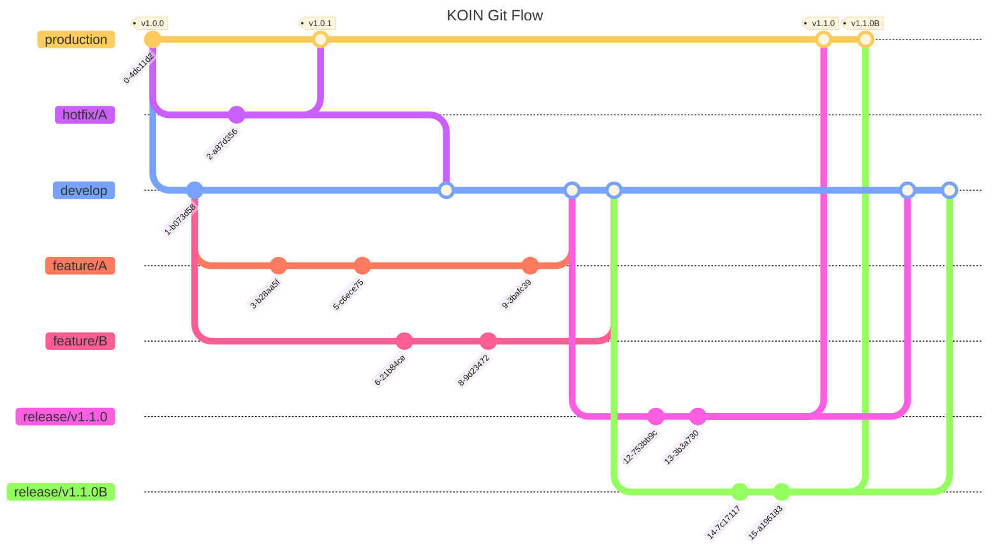

# AGENTS.md

This file provides prescriptive coding guidelines for AI coding agents working in the KOIN_ANDROID repository.

## Commands Reference

### Build Commands
```bash
# Build debug APK
./gradlew assembleDebug

# Build release AAB
./gradlew bundleRelease

# Clean build
./gradlew clean assembleDebug
```

### Test Commands
```bash
# Run all unit tests
./gradlew test

# Run tests for specific module
./gradlew :domain:test
./gradlew :feature:chat:test
./gradlew :data:test

# Run instrumented tests (requires connected device/emulator)
./gradlew connectedAndroidTest
```

### Lint Commands
```bash
# Check code style (MUST pass before commit)
./gradlew ktlintCheck

# Auto-fix lint issues
./gradlew ktlintFormat

# Run all checks
./gradlew check
```

## Architecture Overview

### Multi-Module Structure

This is a **Clean Architecture** Android app with **MVVM + MVI (Orbit)** pattern:

```
koin/          - Main student app (in.koreatech.koin)
business/      - Business app (in.koreatech.business)
domain/        - Repository interfaces, use cases, business models (pure Kotlin)
data/          - Repository implementations, API services, DTOs
core/          - Shared utilities (designsystem, network, analytics, navigation, notification)
feature/       - Feature modules (timetable, bus, store, chat, club, dining, lostandfound, banner)
build-logic/   - Custom Gradle convention plugins
```

### Layer Responsibilities

**MUST** respect these boundaries:

- **Domain Layer** (`domain/`): Pure Kotlin. Repository interfaces, use cases, business models. Uses `Result<T>` or Flow for new code. Legacy code uses `Pair<T?, ErrorHandler?>` pattern.
- **Data Layer** (`data/`): Repository implementations, Retrofit API services, data sources. Handles network/local data.
- **Presentation Layer** (`koin/`, `business/`, `feature/`): ViewModels with Orbit MVI, Jetpack Compose UI, legacy XML views.

**Critical Rule**: ViewModels **MUST** call UseCases. ViewModels **NEVER** call Repositories directly.

### Key Frameworks

- **DI**: Hilt
- **State Management**: Orbit MVI 7.0.1 with Kotlin Coroutines/Flow
- **Networking**: Retrofit + OkHttp, Krossbow STOMP for WebSocket
- **UI**: Jetpack Compose (Material 3) + Legacy XML (see UI Technology Split below)
- **Image Loading**: Glide + Coil
- **Analytics**: Firebase Crashlytics, Analytics, FCM

### UI Technology Split

**CRITICAL**: The codebase uses **different UI technologies** across modules:

| Module | Primary UI Technology | Pattern |
|--------|----------------------|---------|
| `koin/` | **Legacy XML + ViewBinding** | Activities extend `KoinNavigationDrawerActivity`, use `dataBinding<T>()` delegate, Compose embedded via `ComposeView` |
| `business/` | **Jetpack Compose** | Compose-first with Orbit MVI |
| `feature/article` | **Hybrid (XML + Compose)** | Article/search/keyword screens use XML Fragments with Navigation Component; Lost & Found uses pure Compose with Orbit MVI |
| `feature/*` (others) | **Jetpack Compose** | Pure Compose screens with `*Screen` + `*ScreenImpl` pattern |

**koin/ Module Reality**:
- 90+ XML layout files, 24+ Activities, 6+ Fragments
- Only 4 files use `@Composable` (embedded widgets, NOT full screens)
- Navigation is Intent-based, NOT Compose Navigation
- Uses `KoinNavigationDrawerActivity` as base class with `MenuState` enum

**feature/article Module Reality**:
- Article list, detail, search, keyword screens use **Legacy XML Fragments** with Navigation Component
- Lost & Found feature uses **pure Jetpack Compose** with Orbit MVI
- New features in this module **SHOULD** use Compose
- Existing XML screens **MAY** be migrated gradually

**When to use which**:
- **Maintaining koin/ module**: Follow existing Legacy XML patterns
- **New features in koin/**: Embed Compose widgets via `ComposeView.setContent {}` within XML layouts
- **Maintaining feature/article XML screens**: Follow existing Fragment + Navigation Component patterns
- **New features in feature/article**: Use pure Jetpack Compose (like Lost & Found)
- **New features in feature/* or business/**: Use pure Jetpack Compose
- **New standalone screens**: Create in `feature/` module with Compose

## Module-Specific Guidelines

Each module has its own detailed AGENTS.md file with module-specific patterns and rules:

### App Modules
- **[koin/AGENTS.md](koin/AGENTS.md)** - Main student app (**Legacy XML + ViewBinding**, SDK initialization, Intent-based navigation)
- **[business/AGENTS.md](business/AGENTS.md)** - Business owner app (Compose-first, store management)

### Architecture Layers
- **[domain/AGENTS.md](domain/AGENTS.md)** - Pure business logic (use cases, repository interfaces, domain models)
- **[data/AGENTS.md](data/AGENTS.md)** - Data access layer (repository implementations, API services, mappers)

### Core Modules
- **[core/AGENTS.md](core/AGENTS.md)** - Base utilities, DI qualifiers, legacy support classes
- **[core/analytics/AGENTS.md](core/analytics/AGENTS.md)** - Event tracking and analytics
- **[core/designsystem/AGENTS.md](core/designsystem/AGENTS.md)** - Design tokens and UI components
- **[core/navigation/AGENTS.md](core/navigation/AGENTS.md)** - Navigation abstraction
- **[core/network/AGENTS.md](core/network/AGENTS.md)** - Network connectivity monitoring
- **[core/notification/AGENTS.md](core/notification/AGENTS.md)** - System notifications
- **[core/onboarding/AGENTS.md](core/onboarding/AGENTS.md)** - Onboarding tooltips and flows
- **[core/webapp/AGENTS.md](core/webapp/AGENTS.md)** - WebView integration for embedded web apps

### Feature Modules
- **[feature/article/AGENTS.md](feature/article/AGENTS.md)** - University notices, keyword notifications, lost & found (**Hybrid: XML + Compose**)
- **[feature/banner/AGENTS.md](feature/banner/AGENTS.md)** - Banner/carousel display with A/B testing
- **[feature/bus/AGENTS.md](feature/bus/AGENTS.md)** - Bus schedule and route information
- **[feature/chat/AGENTS.md](feature/chat/AGENTS.md)** - Real-time messaging with WebSocket
- **[feature/club/AGENTS.md](feature/club/AGENTS.md)** - Club management and Q&A system
- **[feature/dining/AGENTS.md](feature/dining/AGENTS.md)** - Cafeteria menus and notifications
- **[feature/store/AGENTS.md](feature/store/AGENTS.md)** - E-commerce, cart, and orders
- **[feature/timetable/AGENTS.md](feature/timetable/AGENTS.md)** - Class schedule management
- **[feature/user/AGENTS.md](feature/user/AGENTS.md)** - Authentication and profile management

### Build Infrastructure
- **[build-logic/AGENTS.md](build-logic/AGENTS.md)** - Gradle convention plugins

**ALWAYS** refer to module-specific AGENTS.md for detailed implementation patterns when working on a specific module.

## Code Style Guidelines

### Package & Import Organization

**MUST** use backtick-escaped `in` package and group imports in this order:

```kotlin
package `in`.koreatech.koin.feature.user.ui.signin

import androidx.lifecycle.ViewModel
import dagger.hilt.android.lifecycle.HiltViewModel
import `in`.koreatech.koin.core.analytics.AnalyticsConstant
import `in`.koreatech.koin.domain.usecase.user.UserLoginUseCase
import javax.inject.Inject
import kotlinx.coroutines.flow.MutableStateFlow
import org.orbitmvi.orbit.ContainerHost
```

**Import grouping order**:
1. Android/AndroidX imports
2. Dagger/Hilt imports
3. Internal project imports (backtick-escaped `in`)
4. javax imports
5. kotlinx imports
6. Third-party libraries (Orbit, etc.)

### Naming Conventions

**MUST** follow these patterns:

- **ViewModels**: `PascalCase` + `ViewModel` suffix (e.g., `SignInViewModel`, `StoreDetailViewModel`)
- **Repositories**: 
  - Interface: `PascalCase` + `Repository` suffix (e.g., `UserRepository`)
  - Implementation: Interface name + `Impl` suffix (e.g., `UserRepositoryImpl`)
- **Use Cases**: `PascalCase` + `UseCase` suffix (e.g., `UserLoginUseCase`, `GetStoresUseCase`)
- **Functions**: `camelCase` for all functions (e.g., `setLoginId()`, `fetchStores()`)
- **Variables**: `camelCase` for all variables
- **Private state flows**: Leading underscore (e.g., `_isLoading`)
- **Public state flows**: No underscore (e.g., `isLoading`)
- **Constants**: `SCREAMING_SNAKE_CASE` for top-level/companion constants (e.g., `STORE_ID`, `MAX_RETRY_COUNT`)

### Type Usage

**MUST** use explicit types for public APIs. Type inference is preferred for private/local variables.

**Explicit types required**:
```kotlin
// Public function signatures
suspend fun getToken(loginId: String, hashedPassword: String): AuthToken

// Public state flows
val sessionId: StateFlow<String> = _sessionId

// Container declaration
override val container: Container<SignInState, SignInSideEffect> = 
    container(SignInState())
```

**Inference preferred**:
```kotlin
// Private state flows
private val _sessionId = MutableStateFlow("")

// Local variables
val currentUser = userRepository.getCurrentUser()
```

### Orbit MVI ViewModel Pattern

**MUST** use this pattern for ViewModels:

```kotlin
@HiltViewModel
class SignInViewModel @Inject constructor(
    private val userLoginUseCase: UserLoginUseCase
) : ViewModel(), ContainerHost<SignInState, SignInSideEffect> {
    
    override val container = container<SignInState, SignInSideEffect>(SignInState())
    
    // Synchronous state updates
    fun setLoginId(loginId: String) = blockingIntent {
        reduce { state.copy(loginId = loginId) }
    }
    
    // Asynchronous operations with LEGACY Pair<T?, ErrorHandler?> pattern
    // Uses custom onSuccess/onFailure extensions from domain.util.ErrorHandlerUtil
    fun signIn() = intent {
        userLoginUseCase(state.loginId, state.password)
            .onSuccess {
                postSideEffect(SignInSideEffect.SignInSuccess)
            }
            .onFailure {
                // 'it' is ErrorHandler, not Exception
                reduce { state.copy(loginError = SignInState.LoginError(true, it.message)) }
            }
    }
    
    // Asynchronous operations with MODERN Result<T> pattern
    // Uses Kotlin stdlib onSuccess/onFailure
    fun likeClub(clubId: Int) = intent {
        setClubLikeUseCase(clubId)
            .onSuccess {
                postSideEffect(ClubSideEffect.LikeSuccess)
            }
            .onFailure { exception ->
                // 'exception' is Throwable
                reduce { state.copy(error = exception.message) }
            }
    }
}
```

**Rules**:
- **MUST** annotate with `@HiltViewModel`
- **MUST** implement `ContainerHost<State, SideEffect>`
- **MUST** use `intent { }` for asynchronous operations
- **MUST** use `blockingIntent { }` for synchronous state updates
- **MUST** use `reduce { }` to update state immutably
- **MUST** use `postSideEffect()` for one-time events (navigation, toasts, etc.)
- **NEVER** mutate state directly

### Error Handling with Result<T>

**MUST** use `Result<T>` for error handling in new code:

```kotlin
override suspend fun addCartItem(cartAdd: CartAdd): Result<Unit> {
    return runCatching {
        storeRemoteDataSource.addCartItem(cartAdd.toCartAddRequest())
    }.onFailure { e ->
        return Result.failure(
            when (e) {
                is HttpException -> {
                    when (e.code()) {
                        400 -> when (e.getErrorResponse().code) {
                            "DIFFERENT_SHOP_ITEM_IN_CART" -> 
                                KoinStoreException.DifferentShopItemInCartException()
                            "MENU_SOLD_OUT" -> 
                                KoinStoreException.MenuSoldOutException()
                            else -> KoinStoreException.BadRequestException()
                        }
                        401 -> KoinStoreException.UnauthorizedException()
                        else -> e.getErrorResponse().toKoinUnknownErrorException()
                    }
                }
                else -> e
            }
        )
    }
}
```

**Rules**:
- **MUST** use `Result<T>` as return type for repository functions
- **MUST** use `runCatching { }` to wrap API calls
- **MUST** map HTTP exceptions to domain-specific exceptions
- **MUST** use custom exception classes (e.g., `KoinStoreException`, `KoinUserException`)
- **MUST** preserve original exception in `else` branch

### Use Case Pattern

**MUST** use operator invoke pattern for use cases.

#### ⚠️ TWO Error Handling Patterns Exist

The codebase uses **two different** error handling patterns:

**Pattern 1: Legacy `Pair<T?, ErrorHandler?>` (user/auth domain)**:
```kotlin
class UserLoginUseCase @Inject constructor(
    private val userRepository: UserRepository,
    private val tokenRepository: TokenRepository,
    private val userErrorHandler: UserErrorHandler
) {
    suspend operator fun invoke(
        email: String,
        password: String
    ): Pair<Unit?, ErrorHandler?> {
        return try {
            val authToken = userRepository.getToken(email, password.toSHA256())
            tokenRepository.saveAccessToken(authToken.token)
            tokenRepository.saveRefreshToken(authToken.refreshToken)
            // ... user type handling
            Unit to null  // Success: value to null error
        } catch (throwable: Throwable) {
            null to userErrorHandler.handleGetTokenError(throwable)  // Failure: null to error
        }
    }
}
```

**Pattern 2: Modern Kotlin `Result<T>` (club, chat, timetable, store)**:
```kotlin
class SetClubLikeUseCase @Inject constructor(
    private val clubRepository: ClubRepository
) {
    suspend operator fun invoke(clubId: Int): Result<Unit> =
        clubRepository.setClubLike(clubId)
}
```

**When to use which**:
| Pattern | Use When | Examples |
|---------|----------|----------|
| `Pair<T?, ErrorHandler?>` | Maintaining legacy user/auth code | `UserLoginUseCase`, `UserSignUpUseCase` |
| `Result<T>` | **New features** (preferred) | `SetClubLikeUseCase`, `SendMessageUseCase` |
| `Flow<T>` | Observable/streaming data | `GetLecturesUseCase`, `SubscribeChatRoomUseCase` |

**For NEW code**: Always use `Result<T>` or `Flow<T>`. Do NOT introduce new `Pair<T?, ErrorHandler?>` patterns.

**Rules**:
- **MUST** use `@Inject constructor` for dependency injection
- **MUST** use `operator fun invoke(...)` as the main function
- **MUST** mark as `suspend` if performing async operations
- **NEVER** add business logic beyond orchestrating repository calls

### Compose UI Pattern

**MUST** follow the two-function pattern:

```kotlin
// Outer function: ViewModel connection
@Composable
fun SignInScreen(
    modifier: Modifier = Modifier,
    nextRoute: () -> Unit = {},
    viewModel: SignInViewModel = hiltViewModel()
) {
    val uiState by viewModel.collectAsState()
    val sessionId by viewModel.sessionId.collectAsState()
    
    viewModel.collectSideEffect { sideEffect ->
        when (sideEffect) {
            is SignInSideEffect.SignInSuccess -> nextRoute()
        }
    }
    
    LaunchedEffect(Unit) {
        viewModel.initialize()
    }
    
    SignInScreenImpl(
        loginId = uiState.loginId,
        password = uiState.password,
        isError = uiState.loginError.isError,
        setLoginId = viewModel::setLoginId,
        signIn = viewModel::signIn
    )
}

// Inner function: Pure UI (Preview-compatible)
@Composable
fun SignInScreenImpl(
    loginId: String,
    password: String,
    isError: Boolean,
    modifier: Modifier = Modifier,
    setLoginId: (String) -> Unit = {},
    signIn: () -> Unit = {}
) {
    // Pure UI implementation
}

@Preview(showSystemUi = true)
@Composable
private fun SignInScreenPreview() {
    SignInScreenImpl(loginId = "", password = "", isError = false)
}
```

**Rules**:
- **MUST** split into two functions: `*Screen` (ViewModel-connected) and `*ScreenImpl` (pure UI)
- **MUST** use `hiltViewModel()` in outer function
- **MUST** collect state with `collectAsState()` in outer function
- **MUST** collect side effects with `collectSideEffect` in outer function
- **MUST** pass all state and callbacks as parameters to `*Impl` function
- **MUST** provide default parameter values in `*Impl` for Preview compatibility
- **MUST** add `@Preview` to `*Impl` function (private)
- **NEVER** use ViewModel in `*Impl` function

### Dependency Injection

**MUST** use Hilt for dependency injection:

**ViewModels**:
```kotlin
@HiltViewModel
class MyViewModel @Inject constructor(
    private val useCase: MyUseCase
) : ViewModel(), ContainerHost<State, SideEffect>
```

**Repositories & Use Cases**:
```kotlin
class MyRepositoryImpl @Inject constructor(
    private val remoteDataSource: MyRemoteDataSource,
    private val localDataSource: MyLocalDataSource
) : MyRepository
```

**Modules** (only when needed):
```kotlin
@Module
@InstallIn(SingletonComponent::class)
object MyModule {
    @Provides
    @Singleton
    fun provideMyRepository(
        remoteDataSource: MyRemoteDataSource
    ): MyRepository = MyRepositoryImpl(remoteDataSource)
}
```

**Rules**:
- **MUST** use `@HiltViewModel` for ViewModels
- **MUST** use `@Inject constructor` for repositories and use cases
- **MUST** use `@Singleton` scope for repositories
- **NEVER** manually instantiate dependencies

### State Management

**MUST** use private/public StateFlow pattern:

```kotlin
private val _isLoading = MutableStateFlow(false)
val isLoading: StateFlow<Boolean> = _isLoading

private val _user = MutableStateFlow<User?>(null)
val user: StateFlow<User?> = _user
```

**Rules**:
- **MUST** use `MutableStateFlow` for private backing property with underscore prefix
- **MUST** expose as public `StateFlow` without underscore
- **NEVER** expose `MutableStateFlow` publicly

## Critical Rules

These rules are **non-negotiable**:

1. **Layer Boundaries**: ViewModels **MUST** call UseCases. ViewModels **NEVER** call Repositories directly.

2. **New Features**: **MUST** use Jetpack Compose for all new UI features. Legacy XML views are only for maintenance.

3. **Code Style**: **MUST** run `./gradlew ktlintFormat` before every commit. CI will reject PRs that fail ktlint.

4. **Kotlin Conventions**: **MUST** follow [Kotlin official naming conventions](https://kotlinlang.org/docs/coding-conventions.html).

5. **Dependency Injection**: **NEVER** skip Hilt. **ALWAYS** use `@Inject` or `@Provides`.

6. **Use Case Pattern**: **ALWAYS** use `operator fun invoke()` for use cases. **NEVER** name it `execute()` or similar.

7. **Error Handling**: **MUST** use `Result<T>` for new repository functions. **MUST** map exceptions to domain exceptions.

8. **State Updates**: **ALWAYS** use `reduce { state.copy(...) }` in Orbit. **NEVER** mutate state directly.

9. **Compose Pattern**: **ALWAYS** follow the two-function pattern (`*Screen` + `*ScreenImpl`). **NEVER** use ViewModel in `*Impl`.

10. **Imports**: **MUST** use backtick-escaped package names for `in` (Kotlin reserved keyword).

## Production / Stage
* The package name of Production is in.koreatech.koin
* The package name of Stage is in.koreatech.koin.dev
* **MUST** test on stage.
* **NEVER** test on production

## ktlint Configuration

The following ktlint rules are disabled in `.editorconfig`:

- `ktlint_standard_package-name` - Disabled (allows backtick-escaped `in` package)
- `ktlint_standard_property-naming` - Disabled
- `ktlint_standard_if-else-wrapping` - Disabled
- `ktlint_standard_discouraged-comment-location` - Disabled
- `ktlint_standard_max-line-length` - Disabled
- `ktlint_function_naming_ignore_when_annotated_with` - Composable functions exempt

**Code style**: `android_studio`

## Git Workflow

**MUST** ensure ktlint passes before pushing to any branch.

### Branch Strategy Overview



### Branch Types

| Branch | Purpose | Merge Target |
|--------|---------|--------------|
| `production` | Play Store release branch. Contains production-ready code. | N/A (target branch) |
| `release/[version]` | Release preparation branch. Code fixes, error corrections, and version updates happen here. | `production`, `develop` |
| `develop` | Development integration branch. All feature branches merge here. | N/A (integration branch) |
| `feature/[name]` | Feature development branch. Created per feature unit. | `develop` |
| `hotfix/[name]` | Urgent fix branch. Created when issues arise in release/production. | `production`, `develop` |

### Branch Naming Convention

**MUST** follow these naming patterns:

| Branch Type | Pattern | Example |
|-------------|---------|---------|
| Feature | `feature/#issue-number-description` | `feature/#123-add-login-screen` |
| Bug Fix | `fix/#issue-number-description` | `fix/#456-resolve-crash-on-startup` |
| Hotfix | `hotfix/#issue-number-description` | `hotfix/#789-critical-auth-fix` |
| Release | `release/v[major].[minor].[patch]` | `release/v1.2.0` |

### Workflow Rules

1. **Feature Development**:
   - **MUST** branch from `develop`
   - **MUST** create PR targeting `develop`
   - **MUST** pass ktlint before merging

2. **Release Process**:
   - **MUST** branch from `develop` when ready for release
   - **MUST** merge to both `production` AND `develop` after release
   - **SHOULD** only contain bug fixes and version updates

3. **Hotfix Process**:
   - **MUST** branch from `production` for critical fixes
   - **MUST** merge to both `production` AND `develop`

## Git Commit Convention

Commit messages **MUST** follow this format:

```
<type>: Subject

<body>
```

### Commit Types

| Type | Description |
|------|-------------|
| `feat` | New feature development |
| `add` | Adding code or files that are not new features |
| `fix` | Bug fixes |
| `docs` | Documentation changes (README, AGENTS.md, etc.) |
| `refactor` | Code refactoring without behavior change |
| `test` | Adding or modifying test code |
| `del` | Deleting unnecessary code or files |
| `chore` | Minor changes and maintenance tasks |

### Commit Message Rules

**Type**:
- **MUST** be lowercase

**Subject**:
- **MUST** be written in English
- **MUST** start with a capital letter
- **MUST** be a concise sentence describing the work done
- **MUST** indicate what was accomplished
- **MUST** be 50 characters or less
- **MUST NOT** end with a period

**Body**:
- **MUST** be written in English
- **SHOULD** be used when the subject alone cannot fully explain the changes
- Is optional for simple changes

### Commit Examples

```
feat: Add spring animation for store collapsing toolbar

refactor: Extract common toolbar animation logic

fix: Resolve null pointer exception in user login

docs: Update AGENTS.md with correct bus module patterns

This commit fixes fabricated code examples that did not match
the actual implementation patterns in the codebase.
```


## Required Configuration

`local.properties` **MUST** contain:
- Naver Map API key
- Kakao SDK key
- Signing credentials for release builds

---

**Last Updated**: 2026-01-06
**For**: AI Coding Agents (Claude, Cursor, GitHub Copilot, etc.)
**Maintainers**: BCSD Android Track
