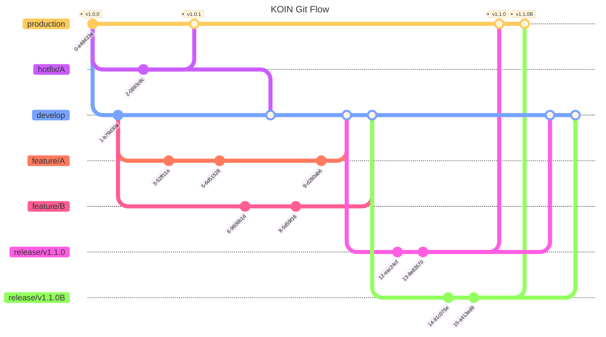

# 코인 - 한기대 커뮤니티

코인은 한국기술교육대학교 학생들을 위하여 제공하는 커뮤니티 플랫폼 서비스입니다.

[코인 - 한기대 커뮤니티 : Google Play Store 바로가기](https://play.google.com/store/apps/details?id=in.koreatech.koin&hl=ko)

[✨ BCSD 블로그와 함께 코인 프로젝트 훔쳐보기 ✨](https://blog.bcsdlab.com/introduce)

## 코인 사장님
`코인 - 한기대 커뮤니티` 앱과는 별도로 사장님들에게 직접 가게를 등록할 수 있도록 코인 사장님 앱을 제공하고 있습니다. 

[코인 사장님 : Google Play Store 바로가기](https://play.google.com/store/apps/details?id=in.koreatech.business&hl=ko)

## Tech Stack
- Java & Kotlin
- XML & Compose
- Jetpack AAC
- Coroutine Flow
- Multi-Module
- MVVM & MVI
- Orbit
- Retrofit2 & OkHttp3
- Gson & kotlinx.serialization
- Hilt
- Timber
- Kakao share
- Naver Map
- Google Analytics
- Firebase Crashlytics
- Firebase Cloud Message
- Firebase App Distribution

## Git Branch Strategy

