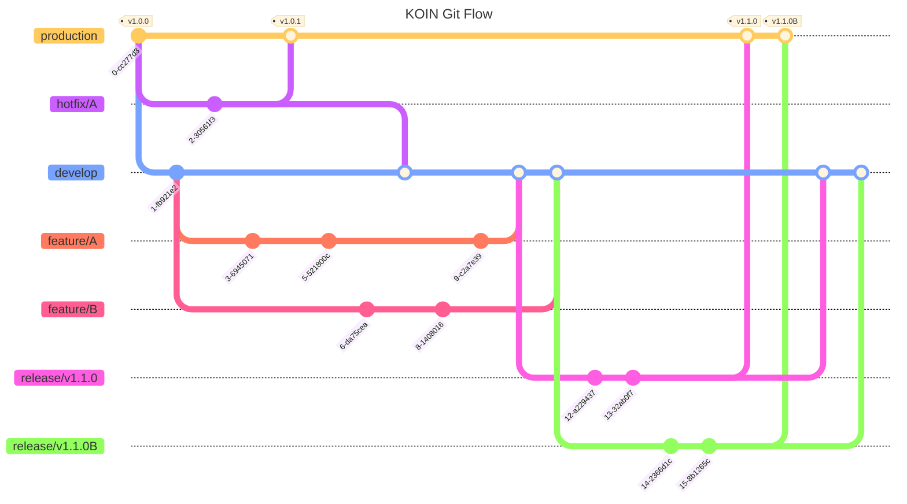

# 코인 - 한기대 커뮤니티

[](https://kotlinlang.org)
[](https://kotlinlang.org)
[](https://gradle.org/)
[](https://gradle.org/)

[](https://developer.android.com/distribute/best-practices/develop/target-sdk)
[](https://developer.android.com/distribute/best-practices/develop/target-sdk)
[](https://developer.android.com/distribute/best-practices/develop/target-sdk)

> [!IMPORTANT]   
> 한국기술교육대학교의 학식, 주변 식당, 버스, 시간표, 공지사항 등 필수 정보를 제공하는   
> DAU 1,100, MAU 3,000명 이상 커뮤니티 서비스 앱으로, 재학생의 60% 이상이 사용하고 있습니다.

> 여러 직무의 팀원들과 각자 전문성을 살려 프로덕트를 개발하고 있습니다.   
> (BackEnd / FrontEnd / Android / iOS / Design / DA / PM / Security)

<p align="left">
  <a href="https://play.google.com/store/apps/details?id=in.koreatech.koin&hl=ko">
    
  </a>
  <a href="https://blog.bcsdlab.com/android">
    
  </a>
</p>

## Tech Stack
| Category | Stack |                                                                                                                                                                                   
|:---:|:---|
| **Language** |                                                                                                                                                                                                                                                                                                                                                                                                    |
| **UI** |                                                                                                                                                                                                                                                                 |
| **Architecture** |                                                               |
| **Jetpack** |                                                                                                                                                                                                                                                                                      |
| **Async** |                                                                                                                                                                                                                                                                                           |
| **Network** |                                                                                                                                                                                                                                                                                       |
| **Serialization** |                                                                                                                                                                                                                                                                     |
| **DI** |                                                                                                                                                                                                                                                                                                                                                                                                       |
| **Logging** |                                                                                                                                                                                                                                                                                                                                                                                                                                |
| **Third Party** |                                                                                                                                                                                                                                                                            |
| **Firebase** |     |

## Module Structure
```text
KOIN_ANDROID/
├── koin/                   # KOIN 앱 모듈 (진입점)
├── domain/                 # Repository 인터페이스 · UseCase · 도메인 모델
├── data/                   # Repository 구현체 · API 서비스 · DTO
├── core/                   # 공통 인프라 모듈
│   ├── analytics/
│   ├── designsystem/
│   ├── navigation/
│   ├── network/
│   ├── notification/
│   ├── onboarding/
│   └── webapp/
├── feature/                # 기능(Feature) 모듈
│   ├── article/
│   ├── banner/
│   ├── bus/
│   ├── callvan/
│   ├── category/
│   ├── chat/
│   ├── club/
│   ├── department/
│   ├── dining/
│   ├── home/
│   ├── lostandfound/
│   ├── notification/
│   ├── profile/
│   ├── recruitment/
│   ├── setting/
│   ├── store/
│   ├── timetable/
│   └── user/
└── build-logic/            # Gradle Convention Plugin 모듈
```

## Feature
| 홈(home) | 카테고리(category) | 게시판(article) | 프로필(profile) |
|:--:|:--:|:--:|:--:|
|  |  |  |  |

<details>
<summary><b>상세 기능 화면</b></summary>
<br>

| 식단(dining) | 주변상점(store) | 버스(bus) | 분실물(lostandfound) |
|:--:|:--:|:--:|:--:|
|  | | | |
| 콜벤팟(callvan) | 팀원모집(recruitment) | 시간표(timetable) | 학교 부서정보(department) |
|  | | | |
| 배너(banner) | 채팅(chat) | 알림(notification) |
|  | | |
</details>

## Git Branch Strategy



```mermaid
---
title: KOIN Git Flow
---

%%{init: { 'logLevel': 'debug', 'theme': 'base', 'gitGraph': {'showBranches': true, 'mainBranchName': 'production'}} }%%
      gitGraph
        commit tag: "v1.0.0"
        branch hotfix/A
        checkout production
        branch develop
        checkout develop
        commit
        branch feature/A
        checkout feature/A
        checkout production
        checkout hotfix/A
        commit
        checkout develop
        checkout feature/A
        commit
        checkout production
        merge hotfix/A tag: "v1.0.1"
        checkout feature/A
        commit
        checkout develop
        branch feature/B
        commit
        checkout develop
        merge hotfix/A
        checkout feature/B
        commit
        checkout feature/A
        commit
        checkout develop
        merge feature/A
        branch release/v1.1.0
        checkout develop
        merge feature/B
        branch release/v1.1.0B
        checkout release/v1.1.0
        commit
        commit
        checkout release/v1.1.0B
        commit
        commit
        checkout production
        merge release/v1.1.0 tag: "v1.1.0"
        merge release/v1.1.0B tag: "v1.1.0B"
        checkout release/v1.1.0
        checkout develop
        merge release/v1.1.0
        merge release/v1.1.0B
```
